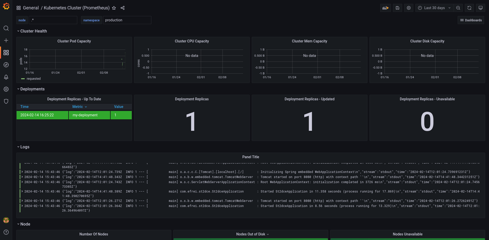
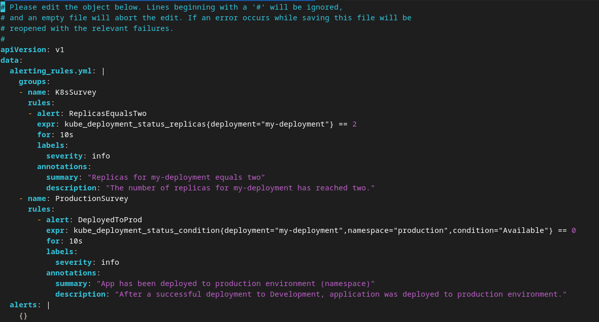
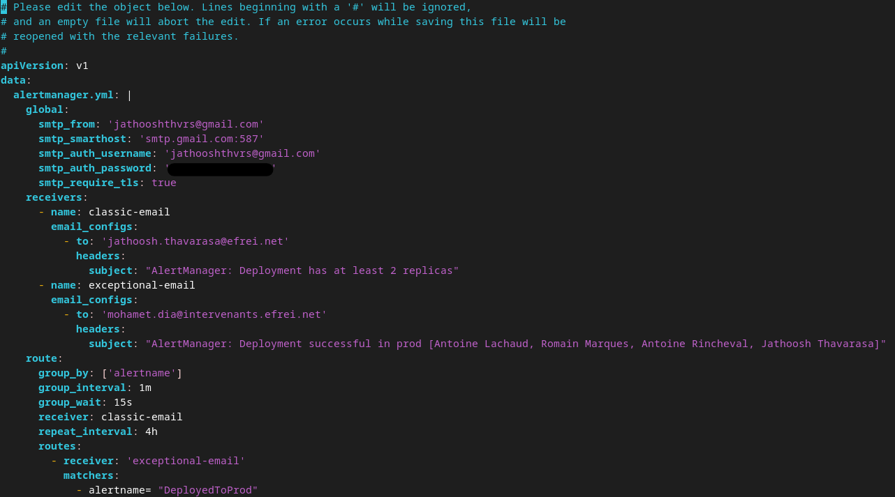
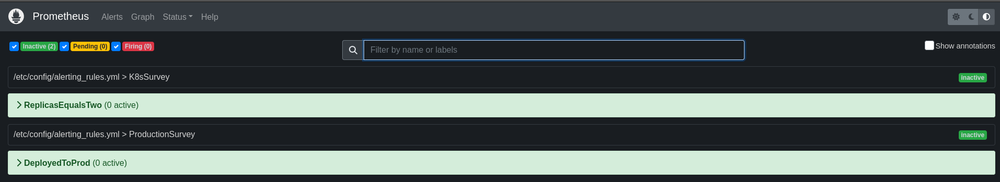
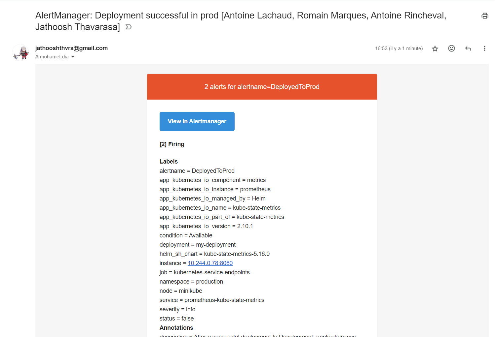
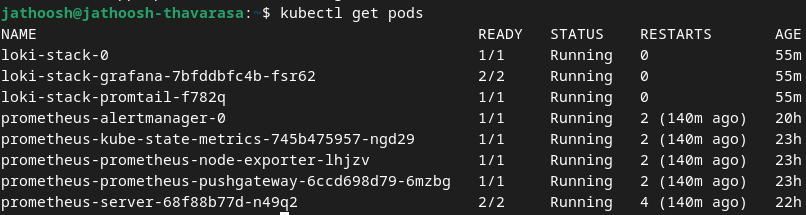
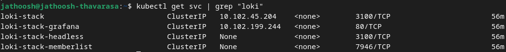

# DevOps Project

## Project Description

This project use a simple Java Program to demonstrate the CI/CD pipeline using Jenkins, Docker, Kubernetes, Grafana, Prometheus, and Loki Stack.

## Prerequisites

- Jenkins with the following plugins : docker-workflow, pipeline-utility-steps
- Docker
- Kubernetes
- Helm (used for installing Grafana, Prometheus, and Loki)

## Steps

### Step 1: Clone the repository

```bash
git clone https://github.com/RomainMarques/ST2DCE-PRJ.git
```

### Step 2: Setup Jenkins

Create a new pipeline job and configure it to use the Jenkinsfile in the repository.
Or copy paste the Jenkinsfile content in a new pipeline job.

### Step 3: Run the pipeline

Run the pipeline and check the logs to see the different steps.

### Step 4: Install Grafana, Prometheus, and Loki

```bash
helm repo add prometheus-community https://prometheus-community.github.io/helm-charts
helm search repo prometheus-community
helm install prometheus prometheus-community/prometheus
```

```bash
helm repo add grafana https://grafana.github.io/helm-charts
helm search repo grafana
helm install loki-stack grafana/loki-stack --set grafana.enabled=true 
# Since Loki-stack is deprecated and we had a compatibility problem with grafana, we use Grafana included with Loki Stack instead
kubectl port-forward pod/NAME_POD_GRAFANA 3000:3000 
# To access Grafana on the port 3000, we need to replace the pod name with the pod name of the Grafana pod
```

### Step 5: Access Grafana

Access Grafana on the port 3000 and login with the default credentials (admin/admin).
To obtain the password, use the following command:

```bash
kubectl get secret loki-stack-grafana -o yaml
# Copy the value of the key 'admin-password' and decode it with the following command
echo "COLLER_ADMIN_PASSWORD" | openssl base64 -d ; echo
# The output is the password for the Grafana admin user
```

## Results (and ConfigMaps)

### Grafana Dashboard



### Prometheus

#### ConfigMaps




#### Prometheus Dashboard



#### AlertManager



## K8s Resources

### Pods



### Services


